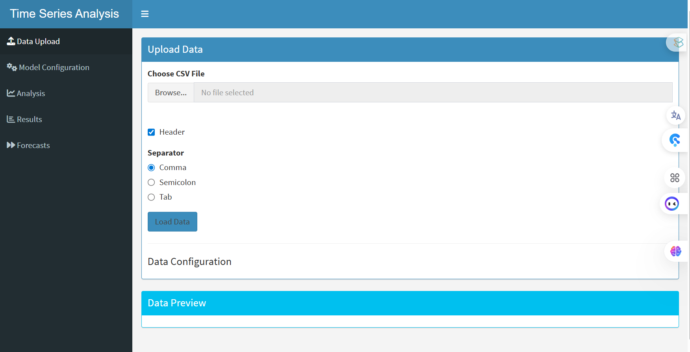
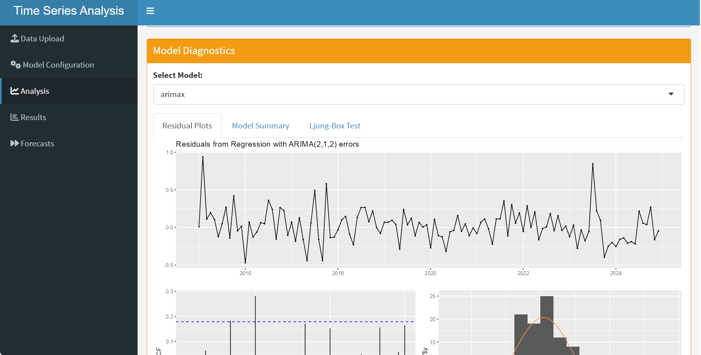

# 📈 Time Series Analysis Tool (Shiny R App)

## 🔗 Access the Tool
**[Click here to launch the application instantly on ShinyApps.io](https://debbyd.shinyapps.io/TimeSeriesForecasting/)**

*(No installation or coding knowledge required)*

## 📖 Overview
A powerful, interactive time series forecasting and modeling application built with R and Shiny, designed to make time series analysis accessible to analysts, researchers, and data scientists. This tool supports multiple ARIMA-based models including **ARIMA, SARIMA, ARIMAX, and SARIMAX**, with full model comparison, diagnostics, and visualization capabilities.

## ✨ Key Features

*   **📤 Upload & Preview**: Easily upload CSV data and configure date, frequency, and target variable.
*   **🎛️ Flexible Modeling**: Choose from ARIMA, SARIMA, ARIMAX, or SARIMAX models with customizable parameter ranges.
*   **🌦️ Exogenous Variables**: Support for external regressors (e.g., temperature, rainfall) with user-defined lags.
*   **⚙️ Data Preprocessing**: Optional log transformation and automatic differencing for stationarity.
*   **📊 Model Comparison**: Compare models using **AIC, RMSE, MAE, and MAPE** with visual performance plots.
*   **🔍 Diagnostics**: Residual analysis, ACF/PACF, stationarity tests (ADF, KPSS), and Ljung-Box tests.
*   **🔮 Forecasting**: Generate and visualize forecasts with confidence intervals (80% and 95%).
*   **💾 Export Results**: Download forecast tables in CSV format.
*   **📈 Interactive Visuals**: Powered by `plotly`, `ggplot2`, and `DT` for dynamic, publication-ready charts.

## 📸 Screenshots
<!-- Create a folder named 'screenshots' in your repo and add images of your app there -->

  
  
  
  

## 🧠 Methodology & Technical Notes

### ARIMAX/SARIMAX Implementation
When using exogenous variables (e.g., Rainfall impacting Sales), the model requires **lags** to be statistically valid.
*   **Data Alignment**: The application automatically aligns the target variable with the lagged exogenous predictors.
*   **Truncation Logic**: To ensure a fair statistical comparison (AIC/RMSE) between models, the dataset is truncated by the maximum lag size chosen. This ensures that ARIMA and ARIMAX models are evaluated on the exact same time window.

### Built With
*   **Shiny & Shinydashboard**
*   **Forecast & Tseries**
*   **Plotly & GGplot2**

## 🤝 Support & Feedback
If you encounter any bugs or have feature requests, please open an issue in this repository.

## 📜 Citation
If you use this tool for your research, please cite it using the "Cite this repository" button on the right sidebar.
